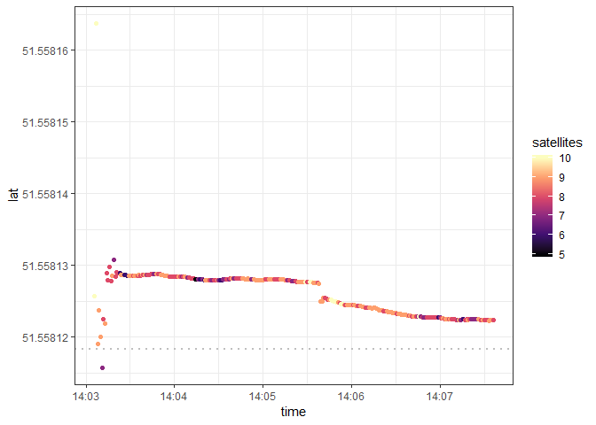
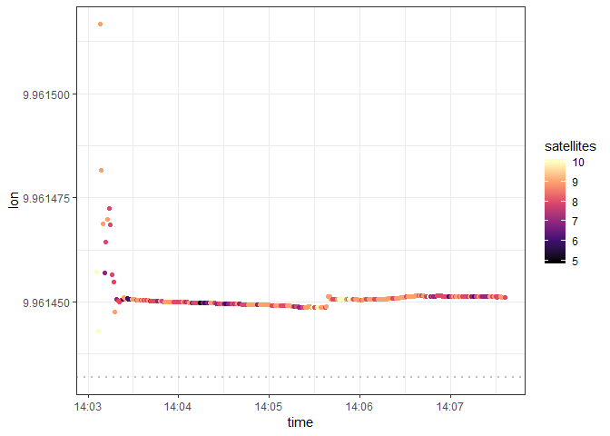
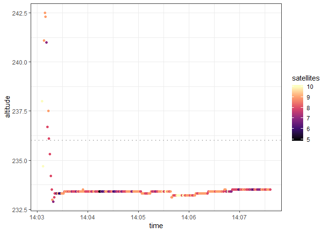
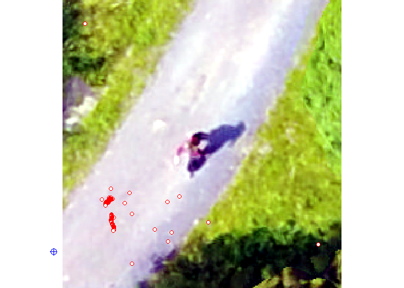
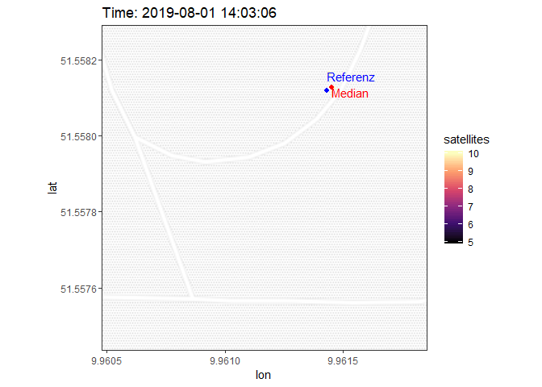
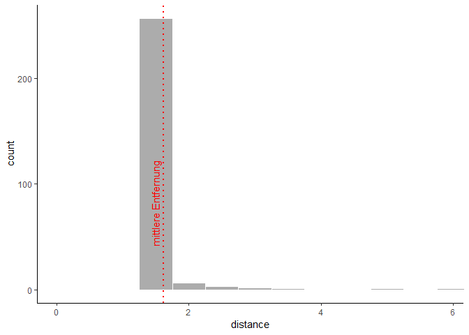

GNSS Uebung
================

Datengenerierung
----------------

**Einlesen der gemessenen Daten**

``` r
# list all nmea files in directory
file_list <- list.files(path = here("raw_data"), pattern = "*.nmea", full.names = T)
# merge files in one dataframe
dataset <- do.call("rbind", lapply(file_list, function(x) {
  dat <- read.table(x, header = FALSE, sep = ",", fill = TRUE, col.names = paste0("V",seq_len(26)))
  # add variable filename
  dat$filename <- tools::file_path_sans_ext(basename(x))
  # add vaiable plot
  dat$plot <-  stringr::str_split(basename(x), stringr::fixed("_"))[[1]][1]
  # add variable device
  dat$device <- stringr::str_split(basename(x), stringr::fixed("_"))[[1]][2]
  dat
}))
```

**Eingabe der Referenzdaten**

``` r
# Soll-Koordinaten (WGS84 /UTM: 32N)
reference.data <- data.frame(
    c("S02", 566695.383, 5712524.386, 291.667, 248),
  c("S01", 566659.820, 5712475.392, 287.097, 244),
  c("S06", 566668.336, 5712380.944, 283.004, 239),
  c("S08", 566747.805, 5712315.910, 284.097, 241),
  c("S09", 566650.005, 5712330.727, 278.666, 236),
  c("S10", 566597.088, 5712312.878, 274.012, 231),
  c("S11", 566579.563, 5712357.726, 274.214, 231),
  c("S12", 566559.544, 5712277.190, 269.066, 226),
  c("S03", 566736.672, 5712468.201, 299.619, 257),
  c("S04", 566726.730, 5712413.092, 291.878, 247),
  c("S05", 566775.776, 5712368.935, 289.469, 247),
  c("S07", 566708.123, 5712339.471, 282.419, 239))
names(reference.data) <- c(1:12)

reference.data <- as.data.frame(t(reference.data))

names(reference.data) <- c("plot","ostwert","nordwert","hoehe_z", "hoehe")

reference.data$ostwert = as.numeric(levels(reference.data$ostwert))[reference.data$ostwert]
reference.data$nordwert = as.numeric(levels(reference.data$nordwert))[reference.data$nordwert]
reference.data$hoehe_z = as.numeric(levels(reference.data$hoehe_z))[reference.data$hoehe_z]
reference.data$hoehe = as.numeric(levels(reference.data$hoehe))[reference.data$hoehe]
```

**Auswahl der Untersuchungsdaten**

``` r
plotnumber = "S09"
devicetype = "SamsungGalaxyTabA"


reference <- reference.data %>% filter(plot == plotnumber)

dat <- dataset %>% filter(plot == plotnumber, 
                          device == devicetype)
```

Datenvorprozessierung
---------------------

**Reprojektion der Referenzdaten**

``` r
# project data from UTM easting northing to latlon
ref.utm <- SpatialPointsDataFrame(coords = data.frame(reference$ostwert, reference$nordwert), 
                                  proj4string = CRS("+proj=utm +zone=32 +datum=WGS84"),
                                  data = data.frame(reference$hoehe_z, reference$hoehe))  
reference <- spTransform(ref.utm, CRS("+proj=longlat +datum=WGS84"))
```

**Auswahl des GPGGA Signals**

``` r
#filter for GGA - essential fix data which provide 3D location and accuracy data.
GPGGA <- dat %>%
  filter(V1 == "$GPGGA") 

#remove empty columns
GPGGA <- Filter(function(x) !(all(x=="")), GPGGA)
```

**Vorprozessierung der gemessenen Daten**

``` r
# rename columns based on meaning (from http://www.gpsinformation.org/dale/nmea.htm#GGA)
names(GPGGA) = c("datatype",
                 "time",
                 "lat",
                 "lat_direction",
                 "lon",
                 "lon_direction",
                 "quality",
                 "satellites",
                 "HDOP",
                 "altitude",
                 "altitude_unit",
                 "h_geoid",
                 "h_geoid_unit",
                 "checksum",
                 "filename",
                 "plot",
                 "device")

# reformat data
GPGGA$datatype = as.factor(GPGGA$datatype)
GPGGA$time =  as.POSIXct(as.character(GPGGA$time), tz = "CET", format = "%H%M%S") 
GPGGA$lat = as.numeric(levels(GPGGA$lat))[GPGGA$lat]
GPGGA$lat_direction = as.factor(GPGGA$lat_direction)
GPGGA$lon = as.numeric(levels(GPGGA$lon))[GPGGA$lon]
GPGGA$lon_direction = as.factor(GPGGA$lon_direction)
GPGGA$quality = as.factor(GPGGA$quality)
GPGGA$satellites = as.numeric(levels(GPGGA$satellites))[GPGGA$satellites]
GPGGA$HDOP = ifelse(is.numeric(GPGGA$HDOP), GPGGA$HDOP, as.numeric(levels(GPGGA$HDOP))[GPGGA$HDOP])
GPGGA$altitude = as.numeric(levels(GPGGA$altitude))[GPGGA$altitude]
GPGGA$altitude_unit = as.factor(GPGGA$altitude_unit)
GPGGA$h_geoid = as.numeric(levels(GPGGA$HDOP))[GPGGA$h_geoid]
GPGGA$h_geoid_unit = as.factor(GPGGA$h_geoid_unit)
GPGGA$checksum = as.factor(GPGGA$checksum)


# convert gnss lat/lon from DDMM.MMMMM to DD.DDDDDD (decimal degrees)
convertISO6709 <- function( DDMM.MMMMM) {
  # It's simpler to do the arithmetic on positive numbers, we'll add the signs
  #  back in at the end.
  sgns   <- sign(DDMM.MMMMM)
  latlon <- abs(DDMM.MMMMM)
  # grab the MM.MMMM bit, which is always <100. '%%' is modular arithmetic.
  mm <- latlon %% 100
  
  # grab the DD bit. Divide by 100 because of the MM.MMMM bit.
  dd <- (latlon - mm)/100
  
  # convert to decimal degrees, don't forget to add the signs back!
  out_latlon <- (dd+mm/60) * sgns
  return(out_latlon)
}

GPGGA[,"lat"]<- convertISO6709(GPGGA[,"lat"])
GPGGA[,"lon"] <- convertISO6709(GPGGA[,"lon"])

m <- GPGGA %>%
  filter(quality != 0) %>%
  arrange(time) %>%
  slice(-1:-4)
```

**Berechnung von Kennwerten**

``` r
ref_h = reference@data$reference.hoehe
ref_N = reference@coords[2]
ref_E = reference@coords[1]

# Abweichung Nord: dev_N = N - ref_N          
dev_N = m$lat - ref_N  
# Abweichung Ost:  dev_E = E - ref_E 
dev_E = m$lon - ref_E 
# Abweichung H?he: dev_h = h - ref_h
dev_h = m$altitude - ref_h
# Abweichung Horizonttal Referenz : dev_hori_ref = sqrt(dev_E^2 + dev_N^2)
dev_hori_ref = sqrt(dev_E^2 + dev_N^2)
# Mittelwert Nord: mean_N = mean(N)
mean_N = mean(m$lat)
# Mittelwert Ost: mean_E = mean(E)
mean_E = mean(m$lon)
# Mittelwert H?he: mean_h = mean(h)
mean_h = mean(m$altitude)
# Abweichung Horizonttal Mittel : dev_hori_mean = sqrt((E - mean_E)^2 + (N - mean_N)^2) 
dev_hori_mean = sqrt((m$lon - mean_E)^2 + (m$lat - mean_N)^2) 
# Systematische Nordabweichung: dev_sys_N = mean_N - ref_N
dev_sys_N = mean_N - ref_N
# Systematische Nordabweichung meter
dev_sys_N_meter = mean(distm (x = data.frame(ref_E, m$lat), y = c(ref_E, ref_N), fun = distHaversine))
# Systematische Ostabweichung: dev_sys_E = mean_E - ref_E 
dev_sys_E = mean_E - ref_E
# Systematische Ostabweichung meter
dev_sys_E_meter = mean(distm (x = data.frame(m$lon, ref_N), y = c(ref_E, ref_N), fun = distHaversine))
# Systematische H?henabweichung: dev_sys_h = mean_h - ref_h  
dev_sys_h = mean_h - ref_h  
# Systematische Horizontalabweichung: dev_sys_hori = sqrt(dev_sys_E^2 + dev_sys_N^2)
dev_sys_hori = sqrt(dev_sys_E^2 + dev_sys_N^2)
# Circular Error Probability (CEP) The radius of circle centered at the true position, containing the position estimate with probability of 50%. 
cep = 0.62*sd(m$lat)+0.56*sd(m$lon)
#calculate distance for each measurement to according reference location
m[ ,"distance"] <- distm (x = data.frame(m$lon, m$lat),
                                           y = c(ref_E, ref_N), 
                                           fun = distHaversine)
# distance between median value and reference value
ref_to_median = distm (x = data.frame(median(m$lon), median(m$lat)),
                                           y = c(ref_E, ref_N), 
                                           fun = distHaversine)
```

Datenauswertung
---------------

### Datentabelle

Auszug der Datentabelle des NMEA Signals. Gefiltert nach GPS fix Daten zur Positionsbestimmung ($GPGGA).

``` r
dt <- m %>% select(-lon_direction,-lat_direction,-distance, -filename, -plot, -device) %>% filter(quality != 0)

tail(dt) %>%
  kable(format = "markdown")
```

<table style="width:100%;">
<colgroup>
<col width="3%" />
<col width="7%" />
<col width="14%" />
<col width="7%" />
<col width="7%" />
<col width="6%" />
<col width="8%" />
<col width="4%" />
<col width="7%" />
<col width="10%" />
<col width="6%" />
<col width="9%" />
<col width="7%" />
</colgroup>
<thead>
<tr class="header">
<th align="left"></th>
<th align="left">datatype</th>
<th align="left">time</th>
<th align="right">lat</th>
<th align="right">lon</th>
<th align="left">quality</th>
<th align="right">satellites</th>
<th align="right">HDOP</th>
<th align="right">altitude</th>
<th align="left">altitude_unit</th>
<th align="right">h_geoid</th>
<th align="left">h_geoid_unit</th>
<th align="left">checksum</th>
</tr>
</thead>
<tbody>
<tr class="odd">
<td align="left">266</td>
<td align="left">$GPGGA</td>
<td align="left">2019-08-01 14:07:31</td>
<td align="right">51.55812</td>
<td align="right">9.961451</td>
<td align="left">1</td>
<td align="right">8</td>
<td align="right">NA</td>
<td align="right">233.5</td>
<td align="left">M</td>
<td align="right">NA</td>
<td align="left">M</td>
<td align="left">*5B</td>
</tr>
<tr class="even">
<td align="left">267</td>
<td align="left">$GPGGA</td>
<td align="left">2019-08-01 14:07:32</td>
<td align="right">51.55812</td>
<td align="right">9.961451</td>
<td align="left">1</td>
<td align="right">8</td>
<td align="right">NA</td>
<td align="right">233.5</td>
<td align="left">M</td>
<td align="right">NA</td>
<td align="left">M</td>
<td align="left">*59</td>
</tr>
<tr class="odd">
<td align="left">268</td>
<td align="left">$GPGGA</td>
<td align="left">2019-08-01 14:07:33</td>
<td align="right">51.55812</td>
<td align="right">9.961451</td>
<td align="left">1</td>
<td align="right">9</td>
<td align="right">NA</td>
<td align="right">233.5</td>
<td align="left">M</td>
<td align="right">NA</td>
<td align="left">M</td>
<td align="left">*57</td>
</tr>
<tr class="even">
<td align="left">269</td>
<td align="left">$GPGGA</td>
<td align="left">2019-08-01 14:07:34</td>
<td align="right">51.55812</td>
<td align="right">9.961451</td>
<td align="left">1</td>
<td align="right">9</td>
<td align="right">NA</td>
<td align="right">233.5</td>
<td align="left">M</td>
<td align="right">NA</td>
<td align="left">M</td>
<td align="left">*57</td>
</tr>
<tr class="odd">
<td align="left">270</td>
<td align="left">$GPGGA</td>
<td align="left">2019-08-01 14:07:35</td>
<td align="right">51.55812</td>
<td align="right">9.961451</td>
<td align="left">1</td>
<td align="right">9</td>
<td align="right">NA</td>
<td align="right">233.5</td>
<td align="left">M</td>
<td align="right">NA</td>
<td align="left">M</td>
<td align="left">*59</td>
</tr>
<tr class="even">
<td align="left">271</td>
<td align="left">$GPGGA</td>
<td align="left">2019-08-01 14:07:36</td>
<td align="right">51.55812</td>
<td align="right">9.961451</td>
<td align="left">1</td>
<td align="right">8</td>
<td align="right">NA</td>
<td align="right">233.5</td>
<td align="left">M</td>
<td align="right">NA</td>
<td align="left">M</td>
<td align="left">*5B</td>
</tr>
</tbody>
</table>

### Breitengrad

``` r
m %>%
  
  ggplot()+
   geom_point(aes(x=time, y=lat, color= satellites)) +
  scale_colour_viridis_c(option="magma") +
  geom_hline(yintercept = ref_N, linetype="dotted", 
                color = "grey", size= 0.8) +
  theme_bw()
```



Systematische Nordabweichung: 0.0000078 Grad
Die mittlere Abweichung des Breitengrads betraegt 0.87 m

### Laengengrad

``` r
m %>%
  
  ggplot()+
   geom_point(aes(x=time, y=lon, color= satellites)) +
  scale_colour_viridis_c(option="magma") +
  geom_hline(yintercept = ref_E, linetype="dotted", 
                color = "grey", size= 0.8) +
  theme_bw()
```



Systematische Ostabweichung: 0.000019
Die mittlere Abweichung des Laengengrads betraegt 1.3 m

### Hoehe (a.s.l.)

``` r
m %>%
  
  ggplot()+
   geom_point(aes(x=time, y=altitude, color= satellites)) +
  scale_colour_viridis_c(option="magma") +
  geom_hline(yintercept = ref_h, linetype="dotted", 
                color = "grey", size= 0.8) +
  theme_bw()
```



Die systematische Hoehenabweichung betraegt -2.4 m

### Position

Messungen ueberlagert auf UAV-Orthophoto

``` r
#load uav
uav <- stack("F:/Lehre/gnss/gnss_nmea/data/uebung/uav/orthomosaik.tif")

sp<-SpatialPointsDataFrame(coords = data.frame(m$lon,m$lat), data=m, proj4string = CRS("+proj=longlat +datum=WGS84"))
sp.utm = spTransform(sp,crs(uav))

ext = extent(min(sp.utm@coords[,1])-(max(sp.utm@coords[,1])-min(sp.utm@coords[,1]))/10,max(sp.utm@coords[,1])+(max(sp.utm@coords[,1])-min(sp.utm@coords[,1]))/10,
             min(sp.utm@coords[,2])-(max(sp.utm@coords[,2])-min(sp.utm@coords[,2]))/10,max(sp.utm@coords[,2])+(max(sp.utm@coords[,2])-min(sp.utm@coords[,2]))/10)

uavcrop <- crop(x= uav, y= ext)

plotRGB(uavcrop,
        r = 1, g = 2, b = 3,
        stretch = "lin")

plot(sp.utm, pch = 21, col="red", bg="white",  add = TRUE)

plot(ref.utm, pch=10, col="blue", cex=1.5,  add = TRUE)
```



Aus GPS Daten geloggte Positionen im Laufe der Messungen.

``` r
# bbox= c(left = median(m$lon)-(max(m$lon)-min(m$lon))/2,
#         bottom =  median(m$lat)-(max(m$lat)-min(m$lat))/2,
#         right = median(m$lon)+(max(m$lon)-min(m$lon))/2,
#         top = median(m$lat)+(max(m$lat)-min(m$lat))/2)

bbox= c(left = min(m$lon), bottom =  min(m$lat), right = max(m$lon), top = max(m$lat))

map <- ggmap(get_stamenmap(bbox, zoom = 18, maptype = "toner-lite", crop=F))+
  geom_point(data = m, aes(x = lon, y = lat, color=satellites), shape = 20, size= 3, alpha=1)+
  geom_point(data = m, aes(x = median(m$lon), y = median(m$lat)), shape = 20, color="Red", size=3)+
  annotate("text", x = median(m$lon), y = median(m$lat), hjust=0,vjust=1,  label = "Median",color="Red") +
  geom_point(x = ref_E, y = ref_N, shape = 20, color="Blue", size=3)+
  annotate("text", x = ref_E, y = ref_N, hjust=0,vjust=-1, label = "Referenz",color="Blue") +
  scale_colour_viridis_c(option="magma")+
  theme_bw()

map +
  transition_time(m$time) +
  labs(title = "Time: {frame_time}") +
  shadow_mark(alpha = 0.3, size = 2)
```



### Entfernung zum Referenzpunkt

``` r
#plot distance from reference location as histogram
p <- ggplot(m, aes(distance)) + 
  geom_histogram(binwidth=0.5, alpha=.5, color="white")+
 # geom_density()+
  coord_cartesian(xlim = c(0, max(m$distance))) +
  geom_vline(xintercept = mean(m$distance), linetype="dotted", 
                color = "red", size= 0.8) +
  annotate("text", x = mean(m$distance), y = 0, hjust= -0.5, vjust =-0.5, angle = 90, label = "mittlere Entfernung",color="Red") +
  theme_classic() 

p
```



Systematische Horizontalabweichung: 0.000021 Grad
Im Mittel betraegt die Entfernung der Messungen zum Referenzpunkt 1.6 m
Die Abweichung zwischen Referenzpunkt und dem Median der Messung betraegt 1.7 m
